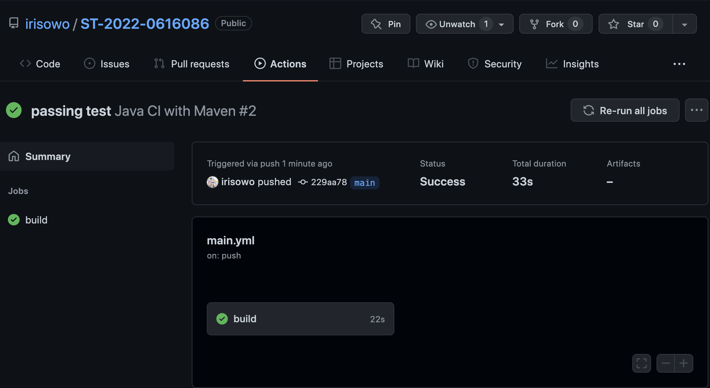
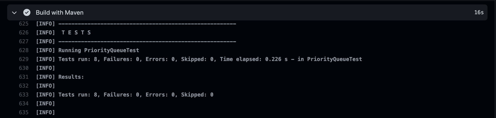
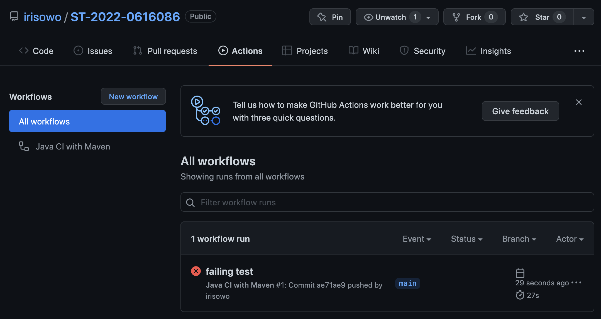
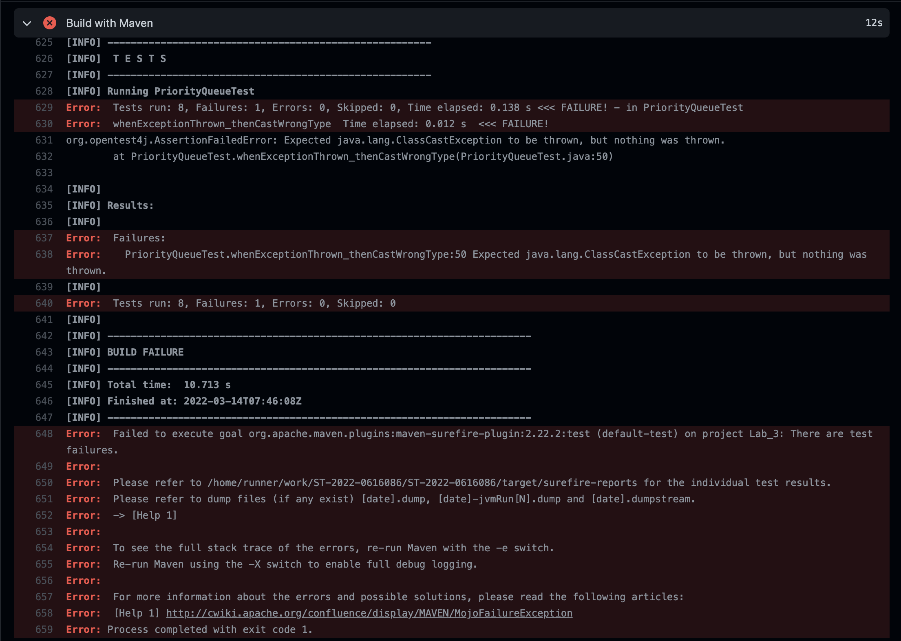

# Lab 3: Continuous Integration

## Part A
- Test **java.util.PriorityQueue class** with Junit.
    - import java.util.PriorityQueue; 
- Parameterization 
    - Each testcase : { random array } , { correct array }. 
        - Random array means to specify **your own input array**. 
        - Correct array means the **PriorityQueue polling correct order** instead of using toArray(). 
        - e.g. arguments(new int[]{5, 4, 2, 3}, new int[]{2, 3, 4, 5}); 
    - Your test must have at least **5** unique testcases. 
- Exception 
    - You have to test at least **3** unique Exceptions that is thrown by PriorityQueue. 
    - The same type of exception in different ways is accepted.

## Part B
- Travis-CI
    - Authorize Travis CI with your Github account.
    - Make sure that Travis CI can be built and test automatically.
- Github
    - Deploy your **Part A (PriorityQueueTest.java)** on Github in public.
    - The name of repository : **ST-2022-student_id**
    - You have to commit twice: 
        - Pass all test cases
        - Unable to pass one of the test cases
    - Add Travis CI status image and screenshots (both pass and fail) to your **README.md**. 
- Submit your Github repository link to E3.

---

# NYCU-Software-Testing-2022-Lab_3


## Pass
* 
* 

## Fail
* 
* 

## Spec
* **Test java.util.PriorityQueue class with Junit**
    * import java.util.PriorityQueue;
* **Parameterization**
    * Testcase : { random array } , { correct array }.
    * Random array specifies your own input array.
    * Correct array means the PriorityQueue polling correct order instead of using toArray().
    * Please Create 5 unique testcases.
* **Exception**
    * There are 3 unique Exceptions thrown by PriorityQueue.
        1. IllegalArgumentException
            * ```whenExceptionThrown_thenInitialCapacityNotGreaterThanOne()```
        2. NullPointerException
            * ```whenExceptionThrown_thenOfferEisNull()```
        3. ClassCastException
            * ```whenExceptionThrown_thenCastWrongType()```
            * Success case : 
                * ```
                   Exception exception = assertThrows(ClassCastException.class, () -> {
                    PriorityQueue pq = new PriorityQueue();
                    pq.add(0);
                    pq.add('0');
                    });             
                    ```
            * Failure case : 
                * ```
                   Exception exception = assertThrows(ClassCastException.class, () -> {
                    PriorityQueue pq = new PriorityQueue();
                    pq.add(0);
                    pq.add(0);
                    });             
                    ```

